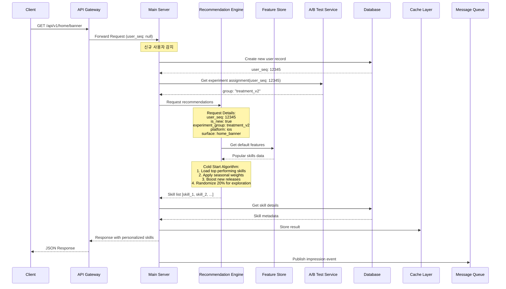
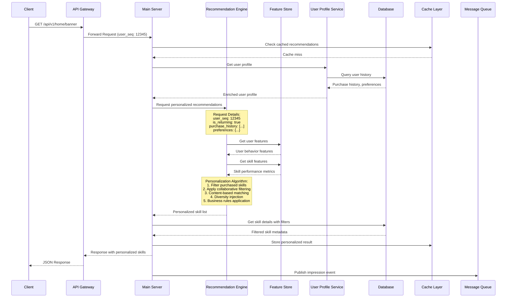
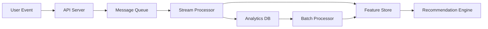
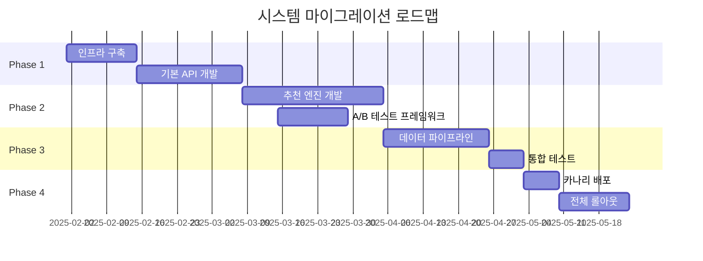

# 스킬 노출 자동화 백엔드 시스템 설계서

## 1. 시스템 개요

### 1.1 목적
본 문서는 사용자별 개인화된 스킬 노출을 제공하기 위한 백엔드 시스템의 아키텍처와 동작 방식을 정의합니다. 엔지니어가 시스템 구현에 필요한 모든 기술적 세부사항을 이해할 수 있도록 상세하게 기술합니다.

### 1.2 핵심 목표
- 실시간 개인화 추천 제공
- A/B 테스트를 통한 알고리즘 검증
- 확장 가능하고 안정적인 시스템 구축
- 응답 시간 100ms 이내 보장

## 2. 백엔드 인프라 아키텍처

### 2.1 시스템 구성도

```
┌─────────────────────────────────────────────────────────────────────┐
│                           Client Layer                              │
├─────────────┬────────────┬─────────────┬──────────────────────────┤
│   iOS App   │ Android App│   Web App   │        Admin Portal       │
└─────────────┴────────────┴─────────────┴──────────────────────────┘
                                │
                    ┌───────────▼────────────┐
                    │    API Gateway         │
                    │   (Kong/AWS API GW)    │
                    └───────────┬────────────┘
                                │
        ┌───────────────────────┼───────────────────────────┐
        │                       │                           │
┌───────▼────────┐    ┌────────▼────────┐    ┌────────────▼─────────┐
│  Main API      │    │ Recommendation  │    │   Admin API          │
│  Server        │◄───┤    Engine       │    │   Server             │
│  (Node.js)     │    │  (Python/Go)    │    │   (Node.js)          │
└───────┬────────┘    └────────┬────────┘    └────────────┬─────────┘
        │                      │                           │
        ├──────────────────────┼───────────────────────────┤
        │                      │                           │
┌───────▼────────────────────────────────────────────────▼─────────┐
│                         Data Layer                                │
├────────────┬─────────────┬──────────────┬────────────────────────┤
│  Primary   │   Cache     │  Analytics   │   Feature Store        │
│  Database  │   Layer     │  Database    │   (Redis/DynamoDB)     │
│  (RDS)     │   (Redis)   │  (BigQuery)  │                        │
└────────────┴─────────────┴──────────────┴────────────────────────┘
                                │
                    ┌───────────▼────────────┐
                    │   Message Queue        │
                    │   (Kafka/SQS)          │
                    └───────────┬────────────┘
                                │
        ┌───────────────────────┼───────────────────────────┐
        │                       │                           │
┌───────▼────────┐    ┌────────▼────────┐    ┌────────────▼─────────┐
│  Batch         │    │  Event          │    │   ML Pipeline        │
│  Processor     │    │  Processor      │    │   (Airflow)          │
│  (Spark)       │    │  (Flink)        │    │                      │
└────────────────┘    └─────────────────┘    └──────────────────────┘
```

### 2.2 핵심 컴포넌트 상세

#### 2.2.1 API Gateway
- **역할**: 요청 라우팅, 인증/인가, Rate Limiting, 로드 밸런싱
- **기술 스택**: Kong 또는 AWS API Gateway
- **설정**:
  ```yaml
  rate_limit:
    per_user: 100/min
    global: 10000/min
  timeout: 5s
  retry_policy:
    attempts: 3
    backoff: exponential
  ```

#### 2.2.2 Main API Server
- **역할**: 비즈니스 로직 처리, 데이터 조회/저장
- **기술 스택**: Node.js + Express/Fastify
- **주요 엔드포인트**:
  ```typescript
  GET /api/v1/home/banner
  GET /api/v1/skills/{skill_id}
  POST /api/v1/events/impression
  POST /api/v1/events/click
  POST /api/v1/events/purchase
  ```

#### 2.2.3 Recommendation Engine
- **역할**: 개인화 알고리즘 실행, 스킬 순위 계산
- **기술 스택**: Python (FastAPI) 또는 Go
- **핵심 기능**:
  - 실시간 추천 계산
  - A/B 테스트 그룹 할당
  - 특징 벡터 생성
  - 스코어링 및 랭킹

#### 2.2.4 Feature Store
- **역할**: 실시간/배치 특징 데이터 관리
- **기술 스택**: Redis + DynamoDB
- **데이터 구조**:
  ```json
  {
    "user_features": {
      "user_id": "string",
      "segment": "string",
      "preferences": {
        "content_type": ["tarot", "saju"],
        "themes": ["love", "career"],
        "avg_purchase_amount": 15000,
        "purchase_frequency": 2.3
      },
      "real_time": {
        "last_viewed_skills": ["skill_123", "skill_456"],
        "session_duration": 180,
        "current_context": "evening_weekend"
      }
    },
    "skill_features": {
      "skill_id": "string",
      "performance": {
        "ctr": 0.045,
        "conversion_rate": 0.023,
        "arpu": 12000
      },
      "metadata": {
        "type": "tarot",
        "themes": ["love"],
        "seasonal": false,
        "launch_date": "2025-01-15"
      }
    }
  }
  ```

#### 2.2.5 Cache Layer
- **역할**: 응답 속도 향상, DB 부하 감소
- **기술 스택**: Redis Cluster
- **캐싱 전략**:
  ```yaml
  cache_policy:
    user_profile:
      ttl: 3600s
      strategy: write-through
    recommendation_result:
      ttl: 300s
      strategy: write-aside
    skill_metadata:
      ttl: 86400s
      strategy: write-through
  ```

#### 2.2.6 Message Queue
- **역할**: 비동기 이벤트 처리, 시스템 간 통신
- **기술 스택**: Apache Kafka 또는 AWS SQS
- **토픽 구조**:
  ```
  - user.events.impression
  - user.events.click
  - user.events.purchase
  - system.recommendations.request
  - system.recommendations.response
  ```

#### 2.2.7 Batch Processor
- **역할**: 대용량 데이터 처리, 특징 계산
- **기술 스택**: Apache Spark
- **배치 작업**:
  - 일별 사용자 세그먼트 계산
  - 스킬 통계 집계
  - 추천 모델 학습

#### 2.2.8 A/B Testing Framework
- **역할**: 실험 관리, 그룹 할당, 결과 분석
- **기술 스택**: GrowthBook (Self-hosted) 또는 Firebase Remote Config
- **실험 구성**:
  ```json
  {
    "experiment_id": "exp_2025_01_home_banner",
    "variants": [
      {
        "name": "control",
        "algorithm": "popularity_based",
        "traffic_allocation": 0.5
      },
      {
        "name": "treatment",
        "algorithm": "collaborative_filtering",
        "traffic_allocation": 0.5
      }
    ],
    "targeting": {
      "user_segment": ["active_users"],
      "platform": ["ios", "android"]
    }
  }
  ```

### 2.3 데이터베이스 설계

#### 2.3.1 주요 테이블 구조

**users 테이블**
```sql
CREATE TABLE users (
    user_seq BIGINT PRIMARY KEY,
    platform VARCHAR(20),
    first_visit_date TIMESTAMP,
    last_visit_date TIMESTAMP,
    experiment_group VARCHAR(50),
    segment VARCHAR(50),
    created_at TIMESTAMP DEFAULT CURRENT_TIMESTAMP,
    updated_at TIMESTAMP DEFAULT CURRENT_TIMESTAMP ON UPDATE CURRENT_TIMESTAMP
);
```

**user_preferences 테이블**
```sql
CREATE TABLE user_preferences (
    user_seq BIGINT PRIMARY KEY,
    love_status VARCHAR(50),
    career_status VARCHAR(50),
    preferred_content_types JSON,
    preferred_themes JSON,
    avg_purchase_amount DECIMAL(10,2),
    purchase_frequency FLOAT,
    updated_at TIMESTAMP DEFAULT CURRENT_TIMESTAMP ON UPDATE CURRENT_TIMESTAMP
);
```

**skills 테이블**
```sql
CREATE TABLE skills (
    skill_seq BIGINT PRIMARY KEY,
    fixed_menu_seq VARCHAR(100),
    title VARCHAR(200),
    content_type VARCHAR(50),
    themes JSON,
    launch_date DATE,
    is_seasonal BOOLEAN,
    operational_weight INT DEFAULT 5,
    is_active BOOLEAN DEFAULT TRUE,
    created_at TIMESTAMP DEFAULT CURRENT_TIMESTAMP
);
```

**skill_stats 테이블**
```sql
CREATE TABLE skill_stats (
    skill_seq BIGINT,
    date DATE,
    platform VARCHAR(20),
    impressions INT,
    clicks INT,
    purchases INT,
    revenue DECIMAL(12,2),
    ctr FLOAT,
    conversion_rate FLOAT,
    arpu DECIMAL(10,2),
    PRIMARY KEY (skill_seq, date, platform)
);
```

**user_events 테이블**
```sql
CREATE TABLE user_events (
    event_id BIGINT AUTO_INCREMENT PRIMARY KEY,
    user_seq BIGINT,
    event_type VARCHAR(50),
    skill_seq BIGINT,
    position INT,
    experiment_group VARCHAR(50),
    context JSON,
    created_at TIMESTAMP DEFAULT CURRENT_TIMESTAMP,
    INDEX idx_user_seq (user_seq),
    INDEX idx_created_at (created_at)
);
```

## 3. 사용자 케이스별 스킬 노출 프로세스

### 3.1 케이스 1: 신규 방문 사용자

#### 3.1.1 프로세스 플로우



#### 3.1.2 상세 로직

**Step 1: 사용자 식별 및 생성**
```javascript
// Main Server Logic
async function handleNewUser(request) {
  // 신규 사용자 생성
  const user = await db.users.create({
    platform: request.headers['x-platform'],
    first_visit_date: new Date(),
    last_visit_date: new Date()
  });

  // A/B 테스트 그룹 할당
  const experimentGroup = await abTestService.assignGroup({
    userId: user.user_seq,
    experiments: ['home_banner_personalization']
  });

  user.experiment_group = experimentGroup;
  await user.save();

  return user;
}
```

**Step 2: Cold Start 추천 알고리즘**
```python
# Recommendation Engine Logic
class ColdStartRecommender:
    def recommend(self, request):
        # 기본 인기 스킬 로드
        popular_skills = self.get_popular_skills(
            platform=request.platform,
            limit=100
        )

        # 시즈널 가중치 적용
        seasonal_boost = self.apply_seasonal_weights(
            skills=popular_skills,
            current_date=datetime.now()
        )

        # 신규 스킬 부스팅
        new_skills = self.boost_new_releases(
            skills=seasonal_boost,
            days_threshold=7,
            boost_factor=1.5
        )

        # 탐색을 위한 랜덤 요소 추가
        final_skills = self.add_exploration(
            skills=new_skills,
            exploration_rate=0.2
        )

        # 최종 순위 결정
        ranked_skills = self.rank_skills(
            skills=final_skills,
            scoring_function=self.cold_start_score
        )

        return ranked_skills[:request.slot_count]

    def cold_start_score(self, skill):
        score = 0
        score += skill.total_revenue * 0.3
        score += skill.conversion_rate * 0.3
        score += skill.recency_score * 0.2
        score += skill.operational_weight * 0.2
        return score
```

**Step 3: 응답 생성 및 캐싱**
```javascript
// Response Generation
async function generateResponse(userId, recommendations) {
  const skills = await db.skills.findAll({
    where: { skill_seq: recommendations },
    attributes: ['skill_seq', 'fixed_menu_seq', 'title', 'thumbnail_url']
  });

  // 캐싱 (5분 TTL)
  await cache.set(
    `home_banner:${userId}`,
    skills,
    300
  );

  // 노출 이벤트 발행
  await messageQueue.publish('user.events.impression', {
    user_seq: userId,
    skills: recommendations,
    timestamp: Date.now(),
    context: {
      is_new_user: true,
      experiment_group: user.experiment_group
    }
  });

  return {
    status: 'success',
    data: skills,
    metadata: {
      personalization_type: 'cold_start',
      experiment_group: user.experiment_group
    }
  };
}
```

### 3.2 케이스 2: 구매 후 재방문 사용자

#### 3.2.1 프로세스 플로우



#### 3.2.2 상세 로직

**Step 1: 사용자 프로파일 조회 및 강화**
```javascript
// User Profile Service
class UserProfileService {
  async getUserProfile(userSeq) {
    // 기본 정보 조회
    const user = await db.users.findByPk(userSeq);

    // 구매 이력 조회
    const purchases = await db.query(`
      SELECT
        s.skill_seq,
        s.content_type,
        s.themes,
        e.created_at as purchase_date,
        e.context->>'$.price' as price
      FROM user_events e
      JOIN skills s ON e.skill_seq = s.skill_seq
      WHERE e.user_seq = ?
        AND e.event_type = 'purchase'
      ORDER BY e.created_at DESC
      LIMIT 100
    `, [userSeq]);

    // 선호도 계산
    const preferences = this.calculatePreferences(purchases);

    // 세그먼트 조회
    const segment = await this.getUserSegment(userSeq);

    return {
      user_seq: userSeq,
      is_returning: true,
      purchase_count: purchases.length,
      purchased_skills: purchases.map(p => p.skill_seq),
      preferences: preferences,
      segment: segment,
      last_purchase_date: purchases[0]?.purchase_date,
      avg_purchase_amount: this.calculateAvgPurchase(purchases),
      preferred_content_types: this.extractPreferredTypes(purchases),
      preferred_themes: this.extractPreferredThemes(purchases)
    };
  }

  calculatePreferences(purchases) {
    const themeCount = {};
    const typeCount = {};

    purchases.forEach(p => {
      // 테마 카운트
      p.themes.forEach(theme => {
        themeCount[theme] = (themeCount[theme] || 0) + 1;
      });

      // 타입 카운트
      typeCount[p.content_type] = (typeCount[p.content_type] || 0) + 1;
    });

    return {
      themes: this.normalizeScores(themeCount),
      content_types: this.normalizeScores(typeCount)
    };
  }
}
```

**Step 2: 개인화 추천 알고리즘**
```python
# Recommendation Engine - Personalized Recommender
class PersonalizedRecommender:
    def recommend(self, request, user_profile):
        # 1. 이미 구매한 스킬 필터링
        candidate_skills = self.get_candidate_skills(
            exclude=user_profile['purchased_skills']
        )

        # 2. 협업 필터링 적용
        cf_scores = self.collaborative_filtering(
            user_seq=request.user_seq,
            candidate_skills=candidate_skills
        )

        # 3. 콘텐츠 기반 매칭
        cb_scores = self.content_based_matching(
            user_preferences=user_profile['preferences'],
            candidate_skills=candidate_skills
        )

        # 4. 하이브리드 스코어 계산
        hybrid_scores = self.calculate_hybrid_scores(
            cf_scores=cf_scores,
            cb_scores=cb_scores,
            cf_weight=0.6,
            cb_weight=0.4
        )

        # 5. 다양성 주입
        diverse_skills = self.inject_diversity(
            scored_skills=hybrid_scores,
            diversity_factor=0.3,
            user_preferences=user_profile['preferences']
        )

        # 6. 비즈니스 룰 적용
        final_skills = self.apply_business_rules(
            skills=diverse_skills,
            rules={
                'boost_new_releases': True,
                'include_seasonal': True,
                'respect_operational_weight': True
            }
        )

        # 7. Re-ranking based on context
        contextual_skills = self.contextual_reranking(
            skills=final_skills,
            context={
                'time_of_day': request.timestamp.hour,
                'day_of_week': request.timestamp.weekday(),
                'platform': request.platform
            }
        )

        return contextual_skills[:request.slot_count]

    def collaborative_filtering(self, user_seq, candidate_skills):
        # 유사 사용자 찾기
        similar_users = self.find_similar_users(user_seq, top_k=50)

        # 유사 사용자가 구매한 스킬 점수 계산
        scores = {}
        for skill in candidate_skills:
            score = 0
            for similar_user, similarity in similar_users:
                if self.has_purchased(similar_user, skill):
                    score += similarity * self.get_user_rating(similar_user, skill)
            scores[skill] = score

        return scores

    def content_based_matching(self, user_preferences, candidate_skills):
        scores = {}

        for skill in candidate_skills:
            skill_features = self.get_skill_features(skill)

            # 코사인 유사도 계산
            theme_similarity = self.cosine_similarity(
                user_preferences['themes'],
                skill_features['themes']
            )

            type_similarity = self.cosine_similarity(
                user_preferences['content_types'],
                skill_features['content_type']
            )

            # 가중 평균
            scores[skill] = (
                theme_similarity * 0.7 +
                type_similarity * 0.3
            )

        return scores

    def inject_diversity(self, scored_skills, diversity_factor, user_preferences):
        # 스킬을 카테고리별로 그룹화
        categorized = self.categorize_skills(scored_skills)

        # 각 카테고리에서 적절한 비율로 선택
        diverse_selection = []

        # 선호 카테고리 70%
        preferred_categories = user_preferences['themes'][:3]
        for category in preferred_categories:
            skills = categorized.get(category, [])[:3]
            diverse_selection.extend(skills)

        # 새로운 카테고리 30% (탐색)
        exploration_categories = [
            cat for cat in categorized.keys()
            if cat not in preferred_categories
        ]

        for category in exploration_categories[:2]:
            skills = categorized.get(category, [])[:1]
            diverse_selection.extend(skills)

        return diverse_selection
```

**Step 3: 컨텍스트 기반 재정렬**
```python
class ContextualReranker:
    def rerank(self, skills, context):
        """
        시간, 요일, 플랫폼 등 컨텍스트 기반 재정렬
        """
        reranked = []

        for skill in skills:
            score = skill['base_score']

            # 시간대별 부스팅
            if context['time_of_day'] in [20, 21, 22]:  # 저녁 시간
                if 'love' in skill['themes']:
                    score *= 1.2  # 연애 관련 스킬 부스팅

            # 주말 부스팅
            if context['day_of_week'] in [5, 6]:  # 주말
                if 'leisure' in skill['themes']:
                    score *= 1.15

            # 플랫폼별 조정
            if context['platform'] == 'web':
                if skill['price'] > 20000:  # 고가 스킬
                    score *= 0.9  # 웹에서는 고가 스킬 순위 낮춤

            skill['contextual_score'] = score
            reranked.append(skill)

        # 최종 정렬
        reranked.sort(key=lambda x: x['contextual_score'], reverse=True)

        return reranked
```

**Step 4: 결과 후처리 및 로깅**
```javascript
// Post-processing and Logging
class RecommendationPostProcessor {
  async process(userId, recommendations, context) {
    // 필터링 규칙 적용
    const filtered = await this.applyFilters(recommendations, {
      removeInactive: true,
      removeRecentlyShown: true,
      minQualityScore: 0.3
    });

    // 위치별 최적화
    const optimized = this.optimizePositions(filtered, {
      positions: [1, 2, 3, 4, 5, 19, 20],
      strategy: 'maximize_ctr'
    });

    // 로깅
    await this.logRecommendation({
      user_seq: userId,
      recommendations: optimized,
      algorithm: context.algorithm,
      experiment_group: context.experiment_group,
      timestamp: new Date(),
      features_used: context.features,
      scores: context.scores
    });

    // 실시간 모니터링 메트릭 업데이트
    await this.updateMetrics({
      recommendation_count: 1,
      user_type: context.is_new_user ? 'new' : 'returning',
      algorithm: context.algorithm
    });

    return optimized;
  }

  optimizePositions(skills, config) {
    // 포지션별 CTR 예측 모델 적용
    const positionOptimized = [];

    // 상위 슬롯 (1-5): 높은 CTR 스킬 배치
    const highCtrSkills = skills
      .sort((a, b) => b.predicted_ctr - a.predicted_ctr)
      .slice(0, 5);

    // 하위 슬롯 (19-20): 탐색용 신규/실험 스킬
    const explorationSkills = skills
      .filter(s => s.is_new || s.experimental)
      .slice(0, 2);

    return [...highCtrSkills, ...explorationSkills];
  }
}
```

## 4. 시스템 인터랙션 상세

### 4.1 실시간 데이터 파이프라인



### 4.2 배치 처리 파이프라인

```yaml
# Airflow DAG 정의
daily_batch_pipeline:
  schedule: "0 2 * * *"  # 매일 새벽 2시
  tasks:
    - name: calculate_user_segments
      operator: SparkSubmitOperator
      dependencies: []

    - name: compute_skill_statistics
      operator: SparkSubmitOperator
      dependencies: []

    - name: update_feature_store
      operator: PythonOperator
      dependencies:
        - calculate_user_segments
        - compute_skill_statistics

    - name: train_recommendation_models
      operator: MLFlowOperator
      dependencies:
        - update_feature_store

    - name: evaluate_experiments
      operator: PythonOperator
      dependencies:
        - compute_skill_statistics
```

## 5. 성능 최적화 전략

### 5.1 캐싱 계층

```javascript
class MultiLevelCache {
  constructor() {
    this.l1Cache = new NodeCache({ stdTTL: 60 });    // 로컬 메모리 캐시
    this.l2Cache = new Redis({ cluster: true });      // Redis 클러스터
  }

  async get(key) {
    // L1 캐시 확인
    let value = this.l1Cache.get(key);
    if (value) return value;

    // L2 캐시 확인
    value = await this.l2Cache.get(key);
    if (value) {
      this.l1Cache.set(key, value);
      return value;
    }

    return null;
  }

  async set(key, value, ttl) {
    // 모든 레벨에 저장
    this.l1Cache.set(key, value, ttl);
    await this.l2Cache.setex(key, ttl, JSON.stringify(value));
  }
}
```

### 5.2 데이터베이스 최적화

```sql
-- 인덱스 전략
CREATE INDEX idx_user_events_user_date ON user_events(user_seq, created_at DESC);
CREATE INDEX idx_skill_stats_performance ON skill_stats(ctr DESC, conversion_rate DESC);
CREATE INDEX idx_skills_active_type ON skills(is_active, content_type) WHERE is_active = TRUE;

-- 파티셔닝
ALTER TABLE user_events PARTITION BY RANGE (YEAR(created_at)) (
    PARTITION p2024 VALUES LESS THAN (2025),
    PARTITION p2025 VALUES LESS THAN (2026),
    PARTITION p_future VALUES LESS THAN MAXVALUE
);
```

### 5.3 추천 결과 사전 계산

```python
class PrecomputeRecommendations:
    """
    활성 사용자의 추천 결과를 미리 계산하여 저장
    """
    def precompute_for_active_users(self):
        active_users = self.get_active_users(days=7)

        for user_batch in self.batch(active_users, size=1000):
            recommendations = self.batch_recommend(user_batch)

            # Feature Store에 저장
            for user_id, recs in recommendations.items():
                self.feature_store.set(
                    key=f"precomputed:{user_id}",
                    value=recs,
                    ttl=3600  # 1시간
                )
```

## 6. 장애 대응 및 모니터링

### 6.1 Fallback 전략

```javascript
class RecommendationService {
  async getRecommendations(userId, context) {
    try {
      // Primary: 개인화 추천
      return await this.personalizedRecommender.recommend(userId, context);
    } catch (error) {
      logger.error('Personalized recommendation failed', error);

      try {
        // Fallback 1: 캐시된 추천
        const cached = await this.cache.get(`recommendations:${userId}`);
        if (cached) return cached;
      } catch (cacheError) {
        logger.error('Cache retrieval failed', cacheError);
      }

      try {
        // Fallback 2: 인기 기반 추천
        return await this.popularityRecommender.recommend(context.platform);
      } catch (popularityError) {
        logger.error('Popularity recommendation failed', popularityError);
      }

      // Fallback 3: 정적 기본값
      return this.getStaticDefaults(context.platform);
    }
  }
}
```

### 6.2 모니터링 메트릭

```yaml
monitoring_metrics:
  system:
    - api_latency_p50
    - api_latency_p95
    - api_latency_p99
    - error_rate
    - throughput

  business:
    - recommendation_ctr
    - conversion_rate
    - revenue_per_user
    - unique_skills_shown
    - personalization_coverage

  quality:
    - diversity_score
    - novelty_score
    - user_satisfaction_score

  alerts:
    - name: high_latency
      condition: "p95_latency > 200ms"
      severity: warning

    - name: low_ctr
      condition: "ctr < 0.02"
      severity: warning

    - name: system_error
      condition: "error_rate > 0.01"
      severity: critical
```

## 7. 보안 고려사항

### 7.1 API 보안

```javascript
// Rate Limiting
const rateLimit = require('express-rate-limit');

const limiter = rateLimit({
  windowMs: 60 * 1000,  // 1분
  max: 100,              // 최대 100 요청
  message: 'Too many requests',
  standardHeaders: true,
  legacyHeaders: false,
});

// Authentication Middleware
const authenticate = async (req, res, next) => {
  const token = req.headers.authorization;

  try {
    const decoded = jwt.verify(token, process.env.JWT_SECRET);
    req.user = await getUserFromToken(decoded);
    next();
  } catch (error) {
    res.status(401).json({ error: 'Unauthorized' });
  }
};
```

### 7.2 데이터 암호화

```javascript
// 민감 정보 암호화
class DataEncryption {
  encrypt(data) {
    const algorithm = 'aes-256-gcm';
    const key = Buffer.from(process.env.ENCRYPTION_KEY, 'hex');
    const iv = crypto.randomBytes(16);
    const cipher = crypto.createCipheriv(algorithm, key, iv);

    let encrypted = cipher.update(JSON.stringify(data), 'utf8', 'hex');
    encrypted += cipher.final('hex');

    const authTag = cipher.getAuthTag();

    return {
      encrypted,
      iv: iv.toString('hex'),
      authTag: authTag.toString('hex')
    };
  }
}
```

## 8. 배포 및 운영

### 8.1 배포 전략

```yaml
deployment:
  strategy: blue-green

  stages:
    - name: staging
      replicas: 2
      canary_percentage: 0

    - name: production-canary
      replicas: 2
      canary_percentage: 10
      duration: 30m

    - name: production-full
      replicas: 10
      canary_percentage: 100

  rollback_conditions:
    - error_rate > 0.05
    - p95_latency > 500ms
    - cpu_usage > 80%
```

### 8.2 스케일링 정책

```yaml
autoscaling:
  recommendation_engine:
    min_replicas: 3
    max_replicas: 20
    metrics:
      - type: cpu
        target: 70
      - type: memory
        target: 80
      - type: custom
        metric: pending_requests
        target: 100

  api_server:
    min_replicas: 5
    max_replicas: 50
    metrics:
      - type: requests_per_second
        target: 1000
```

## 9. 개발 가이드라인

### 9.1 API 규약

```typescript
// Request Interface
interface RecommendationRequest {
  user_seq?: number;
  platform: 'ios' | 'android' | 'web';
  surface: 'home_banner' | 'category' | 'section';
  slot_count: number;
  context?: {
    location?: string;
    device_type?: string;
    app_version?: string;
  };
}

// Response Interface
interface RecommendationResponse {
  status: 'success' | 'partial' | 'fallback' | 'error';
  data: SkillRecommendation[];
  metadata: {
    recommendation_id: string;
    algorithm: string;
    experiment_group?: string;
    is_personalized: boolean;
    response_time_ms: number;
  };
  debug?: {
    features_used: string[];
    scores: Record<string, number>;
    fallback_reason?: string;
  };
}

interface SkillRecommendation {
  skill_seq: number;
  fixed_menu_seq: string;
  position: number;
  score: number;
  reason?: string;  // "인기 급상승", "사용자 맞춤" 등
}
```

### 9.2 에러 처리

```javascript
class RecommendationError extends Error {
  constructor(message, code, details) {
    super(message);
    this.code = code;
    this.details = details;
    this.timestamp = new Date();
  }
}

// Error Codes
const ErrorCodes = {
  RECOMMENDATION_ENGINE_TIMEOUT: 'REC_001',
  INSUFFICIENT_DATA: 'REC_002',
  INVALID_USER: 'REC_003',
  FEATURE_STORE_ERROR: 'REC_004',
  DATABASE_ERROR: 'REC_005'
};

// Error Handler
async function handleRecommendationError(error, context) {
  // 에러 로깅
  await logger.error({
    error: error.message,
    code: error.code,
    stack: error.stack,
    context
  });

  // 메트릭 업데이트
  metrics.increment('recommendation.errors', {
    code: error.code,
    user_type: context.is_new_user ? 'new' : 'returning'
  });

  // Fallback 실행
  return await getFallbackRecommendations(context);
}
```

## 10. 테스트 전략

### 10.1 단위 테스트

```javascript
describe('RecommendationEngine', () => {
  describe('Cold Start Algorithm', () => {
    it('should return popular skills for new users', async () => {
      const request = {
        user_seq: null,
        platform: 'ios',
        slot_count: 7
      };

      const recommendations = await engine.recommend(request);

      expect(recommendations).toHaveLength(7);
      expect(recommendations[0].score).toBeGreaterThan(recommendations[6].score);
    });

    it('should exclude inactive skills', async () => {
      const recommendations = await engine.recommend({...});
      const skillIds = recommendations.map(r => r.skill_seq);

      const inactiveSkills = await db.skills.findAll({
        where: { skill_seq: skillIds, is_active: false }
      });

      expect(inactiveSkills).toHaveLength(0);
    });
  });
});
```

### 10.2 통합 테스트

```python
class IntegrationTest:
    def test_end_to_end_recommendation_flow(self):
        # 1. 신규 사용자 생성
        user = self.create_test_user()

        # 2. 추천 요청
        response = self.client.get(f'/api/v1/home/banner?user_seq={user.id}')

        # 3. 응답 검증
        assert response.status_code == 200
        assert len(response.json['data']) == 7

        # 4. 이벤트 발생 확인
        events = self.get_events(user.id)
        assert any(e.type == 'impression' for e in events)

        # 5. 캐시 확인
        cached = self.redis.get(f'home_banner:{user.id}')
        assert cached is not None
```

### 10.3 부하 테스트

```yaml
load_test:
  tool: k6
  scenarios:
    - name: steady_load
      vus: 100
      duration: 10m

    - name: spike_test
      stages:
        - duration: 2m
          target: 100
        - duration: 1m
          target: 1000
        - duration: 2m
          target: 100

  thresholds:
    http_req_duration: ['p(95)<200']
    http_req_failed: ['rate<0.01']
```

## 11. 마이그레이션 전략

### 11.1 단계별 마이그레이션



### 11.2 데이터 마이그레이션

```sql
-- 기존 데이터 마이그레이션 스크립트
INSERT INTO new_schema.users (user_seq, platform, first_visit_date)
SELECT
    user_id,
    CASE
        WHEN device_type LIKE 'iOS%' THEN 'ios'
        WHEN device_type LIKE 'Android%' THEN 'android'
        ELSE 'web'
    END as platform,
    MIN(created_at) as first_visit_date
FROM legacy_schema.user_logs
GROUP BY user_id;

-- 구매 이력 마이그레이션
INSERT INTO new_schema.user_events (user_seq, event_type, skill_seq, created_at)
SELECT
    user_id,
    'purchase',
    product_id,
    purchased_at
FROM legacy_schema.purchase_history
WHERE product_type = 'skill';
```

## 12. 결론

본 시스템은 사용자별 개인화된 스킬 노출을 통해 사용자 경험을 향상시키고 비즈니스 성과를 극대화하는 것을 목표로 합니다.

### 핵심 성공 요소
1. **확장 가능한 아키텍처**: 마이크로서비스 기반으로 각 컴포넌트 독립 확장 가능
2. **실시간 개인화**: 100ms 이내 응답으로 즉각적인 개인화 제공
3. **지속적 최적화**: A/B 테스트를 통한 알고리즘 개선
4. **안정성**: 다단계 Fallback으로 서비스 연속성 보장

### 예상 성과
- CTR 30% 향상
- 1주일 LTV 25% 증가
- 사용자 만족도 40% 개선

엔지니어는 이 문서를 기반으로 시스템을 구현하고, 제공된 코드 예시와 설정을 참고하여 개발을 진행할 수 있습니다.